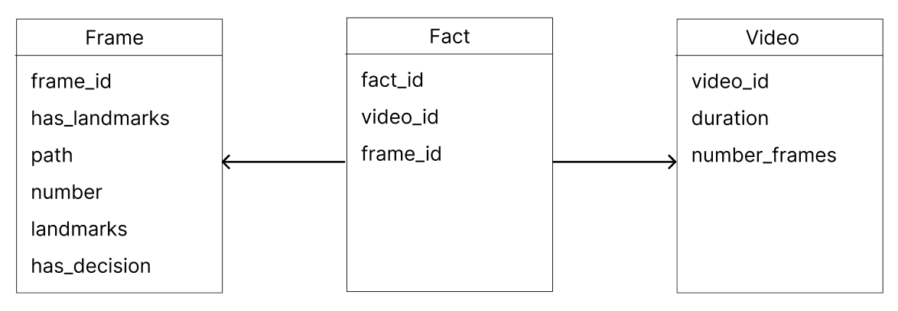
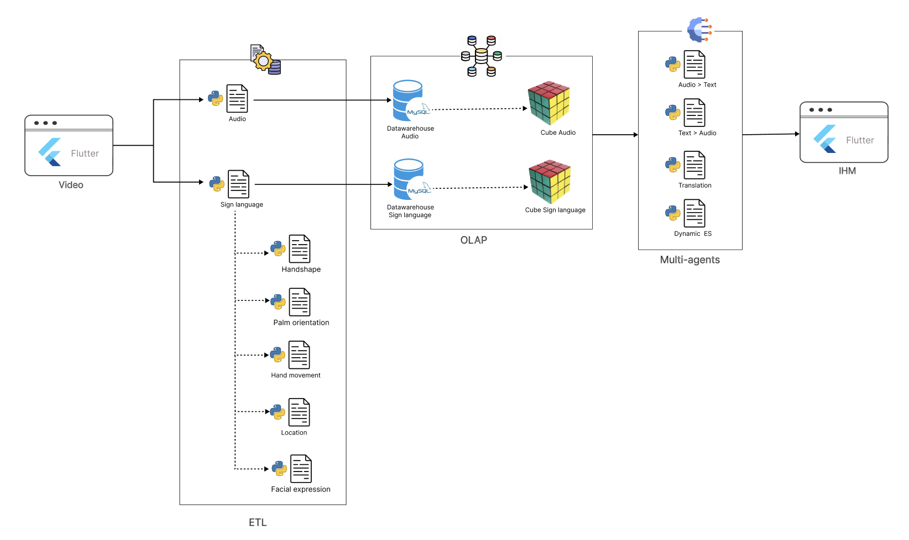
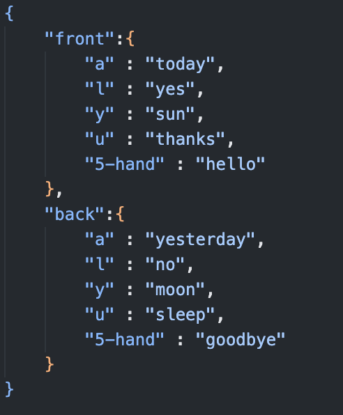
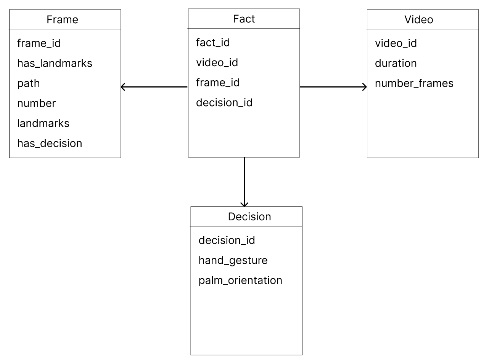
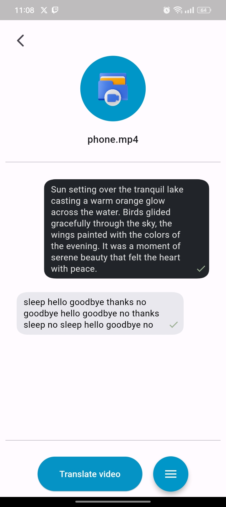
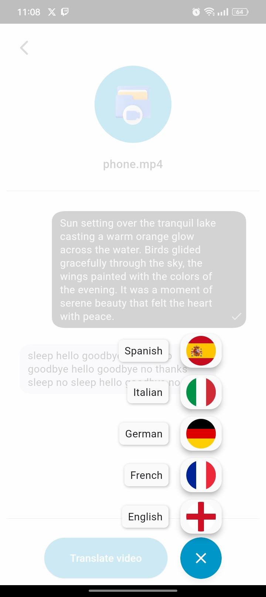

# Bridge

## Introduction
This project is part of a mid semester college project that allows the upload and translation of audio (speech) and video (sign language + speech) files using business intelligence architecture.
This project also includes a flutter project to test the BI architecture.
To facilitate development and accelerate the execution, the global BI project is decomposed into 2 seperate BI architectures (Audio architecture and Video architecture) that run simultaniously.

## Global architecture
The global architecture contains both the **video** and **audio** architecure that execute independently and simultaniously.


## Audio architecture
The audio architecture contains the following elements :
- **ETL (Extract, Transform, Load)** : An ETL process is used to extract audio from videos, analyze the audio, and load the resulting data into a MySQL Data Warehouse.
- **OLAP (Online Analytical Processing)** : An OLAP cube is created from the data stored in the Data Warehouse, allowing for multidimensional analysis.
- **Agent** : An agent is used to convert audio into text.


### Required dependencies
- **moviepy** : moviePy is a Python library that allows you to process video files, edit them, create video clips, and perform various operations on videos.

- **mysql-connector** : This library is an official Python driver for communicating with MySQL databases. It allows you to connect to a MySQL database and manage data read and write operations.

- **pydub** : pydub is a Python library that makes it easier to manipulate audio files.

- **cubes** : cubes is a Python library for creating OLAP (Online Analytical Processing) cubes. You can use it to define, create, and query multidimensional cubes from your data stored in the MySQL Data Warehouse.

- **Whisper (OpenAI)** : Whisper is a speech recognition model developed by OpenAI.


## Video architecture V1
The video architecture v1 contains the following elements :
- **ETL (Extract, Transform, Load)** : An ETL process is used to extract the frames from the video and recognize in each frame the existance of a hand and the gesture the hand is making and translates this gesture into landmarks (a numpy array that represents each part of the hand (thumb, index, distance of the fingers, ...)).
and finally the etl process loads each frame and its corresponding data into mysql datawarehouse.

- **OLAP (Online Analytical Processing)** : An OLAP cube is created from the data stored in the Data Warehouse, allowing for multidimensional analysis.

- **Agent** : An agent is used to extract the landmarks related to the video from the created cube and returns the words that each landmark represents.

<p align="center">
    
</p>

### Critique
video architecture V1 represents the standard process pf translating sign language, which relies on the recognition of **words**, its limitations are:

- **Accuracy** : The more words the model is trained on, the less accurate the model becomes.

- **Training time** : if we want to add a new word, we have to include it in the dataset and retrain the model, and if the dataset contains thousands of words, the training could take hours.

### Existing solutions

https://paperswithcode.com/task/sign-language-recognition


## Video architecture V2
The video architecture v2 represents our BI based solution to the problems mentioned in the V1 architecture, to understand our solution we must first look to the hand elements that make up a word in sign language :

1. Hand shape (A, L, 5-hand, V, ...) (40 total)

2. Palm orientation (forward, backward, straight, ...) (5 total)

3. Hand movement (wave, up_down, down_up, ...) (10 total)

4. Location of the hand (nose, chin, elbow, ...) (30 total)

5. Facial expression (neutral, happy, angry, ...) (5 total)

The idea is to create for each of the five element their own dataset, their own model and their own prediction program, afterwards the result of each prediction is passed to a dynamic expert system that returns the corresponding word of the 5 predictions.

<p align="center">
    
</p>

<p align="center">
       
</p>


Number of words possible : 
780 * 10 * 45 * 435 * 5 = 81,562,500

The advantages of this solution are: 

- **Dataset** : The size of the dataset is consistant no matter the number of words added.

- **Training** : The training only happens once, afterwards each word added is added into the json file of the expert system (no training needed).

- **Accuracy** : The since the dataset is consistant, the accuracy is also consistant no matter the number of words added.

The elements of this solution are :

- **ETL (Extract, Transform, Load)** : An ETL process is used to extract the frames from the video, afterwards each frame is passed and converted into landmarks, each landmark is then passed to each recognition model to extract the 5 elements the constitues the hand in the frame. And finally the etl process loads each frame and its corresponding data into mysql datawarehouse.

- **OLAP (Online Analytical Processing)** : An OLAP cube is created from the data stored in the Data Warehouse, allowing for multidimensional analysis.

- **Agent** : The agent is a dynmaic expert systems, extract the elements of the hand that are in the frame and returns the corresponding word.

<p align="center">
    
</p>

### Required dependencies
- **experta** : used to create the expert system.

## Installation
To set up the project, follow these steps:

1. Clone the repository:
   ```bash
   git clone https://github.com/YassineLayouni/Bridge.git

2. Create a virtual environment (recommended):
   ```bash
   python -m virtualenv _env_ --python=Path python 3.8

3. Activate the virtual environment:
    ```bash
    _env_\Scripts\activate

4. Install project dependencies:
    ```bash
    pip install -r requirements.txt

5. Run the application:
   ```bash
    cd v1
    ````
    ```bash
    python upload_video_server.py
    ```

## Screenshots


<p float="left" align="center">
    
    
    
    
    
</p>


